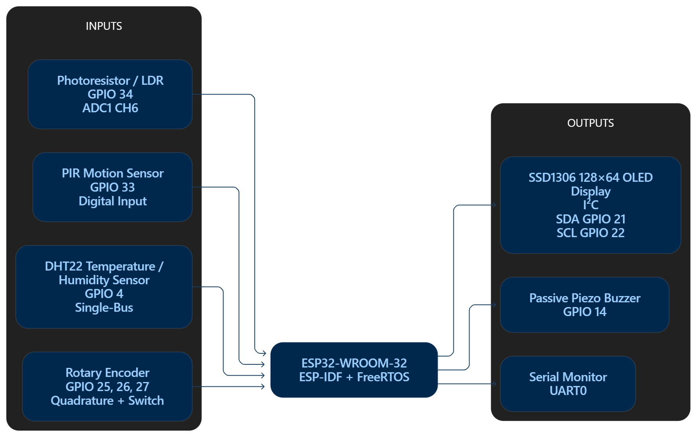
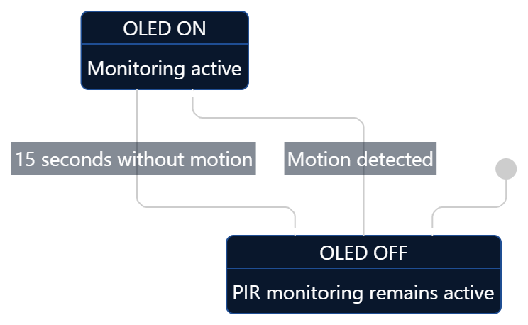
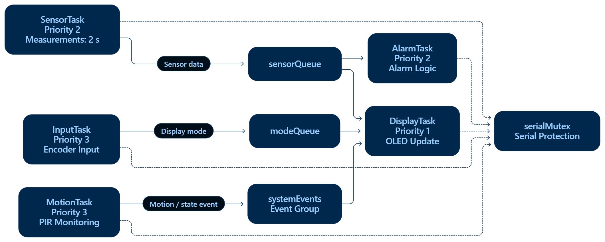
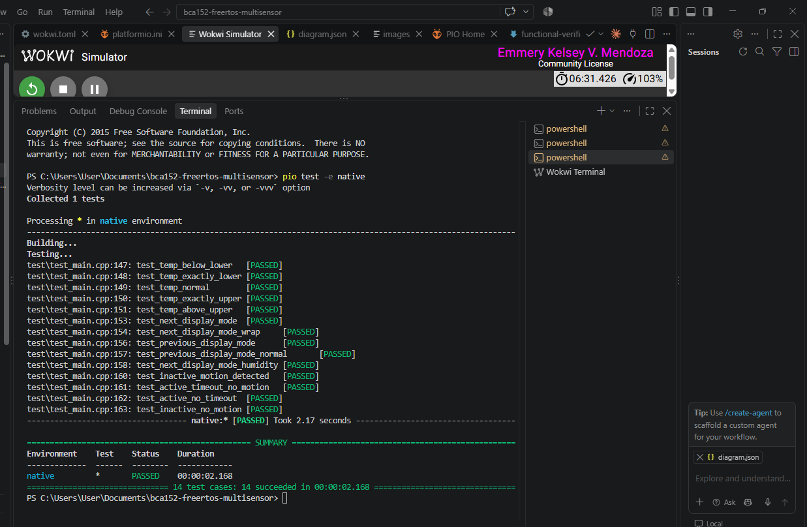
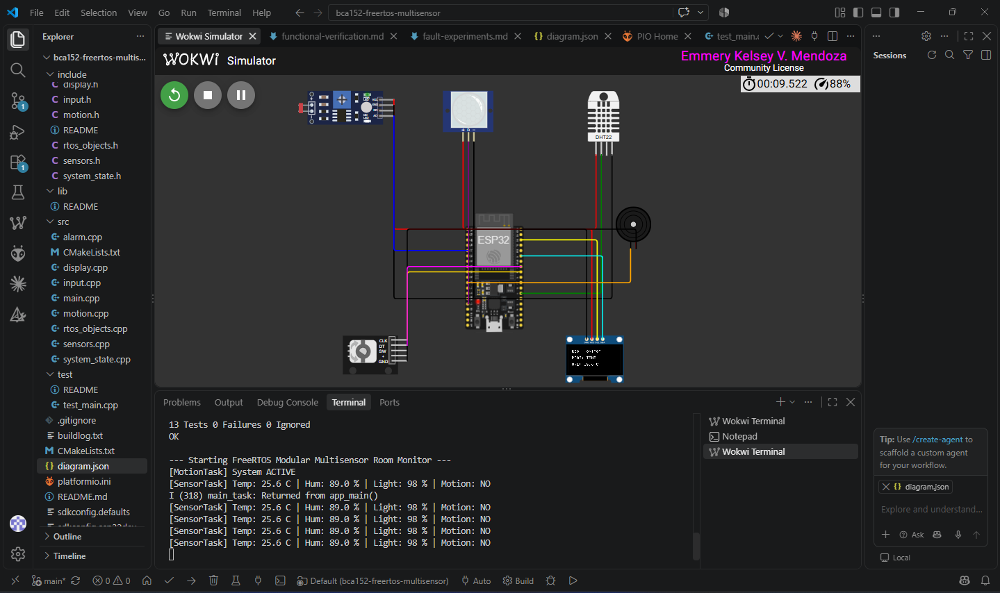

# Laboratory Report: Real-Time Multisensor Room Monitoring System

**Course:** BCA152 – Microcontrollers  
**Activity:** Laboratory Activity No. 1  
**Student Name:** Emmery Kelsey V. Mendoza  
**Repository:** bca152-freertos-multisensor  

---

## 1. Problem and Requirements

### 1.1 Problem Statement
The laboratory requires the design and implementation of a simulated ESP32-based room-monitoring system using the ESP-IDF framework and native FreeRTOS APIs. The system must monitor environmental conditions (temperature, humidity, and ambient light), detect motion, provide rotary-encoder-based user navigation, display information on an SSD1306 OLED, and activate an alarm when temperature exceeds configured limits. The firmware must be organized as a concurrent embedded system with multiple FreeRTOS tasks, inter-task communication mechanisms, and a documented state machine.

### 1.2 Functional Requirements
The system implements the following functional requirements:

| ID | Requirement | Implementation |
| :--- | :--- | :--- |
| **FR-01** | Temperature measurement | SensorTask reads DHT22 every 2 seconds |
| **FR-02** | Humidity measurement | SensorTask reads DHT22 every 2 seconds |
| **FR-03** | Ambient-light measurement | SensorTask reads LDR via ADC1 channel 6 |
| **FR-04** | Motion detection | MotionTask monitors PIR sensor at 100 ms period |
| **FR-05** | OLED display | DisplayTask displays one measurement at a time |
| **FR-06** | Rotary encoder navigation | InputTask switches among Temperature, Humidity, Light, and Motion |
| **FR-07** | Temperature alarm | AlarmTask activates buzzer when temperature ≤ 18 °C or ≥ 30 °C |
| **FR-08** | Activity state | System supports ACTIVE and INACTIVE states |
| **FR-09** | Automatic inactivity | After 15 seconds without motion, system enters INACTIVE |
| **FR-10** | Automatic reactivation | Motion returns the system to ACTIVE |

### 1.3 Wokwi Adaptation
The physical hardware is replaced by Wokwi simulation components: ESP32 DevKit, DHT22, LDR, PIR sensor, rotary encoder, SSD1306 OLED, and a passive piezo buzzer. The firmware uses the ESP-IDF framework exclusively; no Arduino-specific abstractions are used.

---

## 2. System Architecture and Design

### 2.1 Hardware Architecture
The simulated circuit consists of the following components and pin assignments (as depicted in the hardware diagram):

| Component | ESP32 Pin | Interface |
| :--- | :--- | :--- |
| **DHT22 (data)** | GPIO 4 | Single-Bus (One-wire) |
| **LDR** | GPIO 34 (ADC1 CH6) | ADC (12-bit) |
| **PIR sensor** | GPIO 33 | Digital input |
| **Rotary encoder** | GPIO 25, 26, 27 | Quadrature + Switch |
| **SSD1306 OLED SDA** | GPIO 21 | I2C |
| **SSD1306 OLED SCL** | GPIO 22 | I2C |
| **Buzzer** | GPIO 14 | PWM (Passive Piezo) |

The DHT22 is configured as an open-drain GPIO with a pull-up; the LDR is read through the ESP-IDF oneshot ADC driver. The OLED is connected via I2C, and the buzzer is driven via LEDC PWM.

### 2.2 Software Architecture
The application is decomposed into the following source modules:

    bca152-freertos-multisensor/
    |-- include/
    |   |-- alarm.h
    |   |-- display.h
    |   |-- input.h
    |   |-- motion.h
    |   |-- rtos_objects.h
    |   |-- sensors.h
    |   `-- system_state.h
    |-- src/
    |   |-- alarm.cpp
    |   |-- display.cpp
    |   |-- input.cpp
    |   |-- motion.cpp
    |   |-- rtos_objects.cpp
    |   |-- sensors.cpp
    |   |-- system_state.cpp
    |   `-- main.cpp
    |-- test/
    |   `-- test_main.cpp
    `-- platformio.ini

`main.cpp` is intentionally minimal: it initializes RTOS objects, initializes sensors, runs embedded unit tests, and creates the FreeRTOS tasks. The application does not reside in a single monolithic file.

### 2.3 State Machine
The system operates as a two-state machine, as shown in the state transition diagram:

    inactivity timeout (15 s)
    ACTIVE ------------------------------> INACTIVE
       ^                                        |
       `---------- motion detected -------------'

* **ACTIVE:** OLED ON (Monitoring active), sensor processing active, encoder responsive, alarm active.
* **INACTIVE:** OLED OFF, unnecessary display operations reduced, PIR monitoring remains operational.

The state transitions are evaluated by the pure function `evaluateSystemState()` in `system_state.cpp`.

---

## 3. FreeRTOS Architecture

### 3.1 Task Design and Priorities
The system uses five primary tasks with explicit priorities:

| Task | Responsibility | Trigger / Period | Priority | IPC | Typical Blocked Condition |
| :--- | :--- | :--- | :---: | :--- | :--- |
| **MotionTask** | PIR monitoring, ACTIVE/INACTIVE state | 100 ms periodic (`vTaskDelayUntil`) | 3 | Event group | `vTaskDelayUntil` |
| **InputTask** | Rotary encoder navigation | Short periodic / event | 3 | Queue (`modeQueue`) | `vTaskDelay` / queue wait |
| **SensorTask** | DHT22 and LDR acquisition | 2 s periodic (`vTaskDelayUntil`) | 2 | Queue (`sensorQueue`) | `vTaskDelayUntil` |
| **AlarmTask** | Temperature alarm evaluation and buzzer | Sensor update (50 ms polling) | 2 | Queue (`sensorQueue`) | `vTaskDelay` |
| **DisplayTask** | OLED ownership and rendering | Event / update | 1 | Queue (`modeQueue`, `sensorQueue`) | Waiting for data |

#### Priority Justification:
* **MotionTask (priority 3):** Motion detection is the most time-sensitive input. The system must respond to motion within milliseconds to ensure timely wake-up from INACTIVE state and to reset the inactivity timer.
* **InputTask (priority 3):** Rotary encoder input is user-facing and requires prompt response to avoid missed detents or sluggish navigation. It shares the same priority as MotionTask because both are input-driven and latency-sensitive.
* **SensorTask (priority 2):** Sensor sampling is periodic (every 2 seconds). While important, a slight delay in sensor acquisition does not affect system responsiveness.
* **AlarmTask (priority 2):** The alarm decision must be evaluated promptly after sensor data arrives, but the temperature environment changes slowly relative to task scheduling timescales.
* **DisplayTask (priority 1):** Display updates are purely informational. A delayed OLED refresh does not affect system safety or responsiveness. The lowest priority ensures input and sensor processing are never starved by display rendering.

### 3.2 Periodic Execution with vTaskDelayUntil()
Both `SensorTask` and `MotionTask` use `vTaskDelayUntil()` for periodic execution. This function specifies an absolute wake time rather than a relative delay. The key advantage is that the task's execution period remains constant regardless of how long the task's work takes, preventing cumulative timing drift. With `vTaskDelay()`, the delay is relative to the time the function is called; if task execution time varies, the effective period drifts. `vTaskDelayUntil()` maintains a fixed period by calculating the next wake time from the previous wake time, making it the correct choice for periodic sensor sampling and motion polling.

### 3.3 Inter-Task Communication

* **Sensor Queue (`sensorQueue`):** A queue of length 1 carrying `SensorData` structures. `SensorTask` produces data; `AlarmTask` and `DisplayTask` consume it. `AlarmTask` uses `xQueuePeek()` to read the latest value without removing it, ensuring the display can also access the same data. This decouples sensor acquisition from consumption, avoiding unsynchronized global variables.
* **Mode Queue (`modeQueue`):** A queue of length 1 carrying `DisplayMode` enumeration values. `InputTask` overwrites the queue with the current mode using `xQueueOverwrite()`; `DisplayTask` reads it to determine which measurement to render.
* **Event Group (`systemEvents`):** Three bits are defined:

| Bit | Name | Producer | Consumer | Set/Clear Condition |
| :--- | :--- | :--- | :--- | :--- |
| **BIT0** | `EVENT_ACTIVE` | MotionTask | System logic | Set on motion, cleared after 15 s inactivity |
| **BIT1** | `EVENT_MOTION` | MotionTask | System logic | Set when motion detected, cleared when no motion |
| **BIT2** | `EVENT_ALARM` | AlarmTask | (reserved) | Set when alarm active |

### 3.4 Shared-Resource Protection: Serial Mutex
The shared resource protected by `serialMutex` is the serial (UART) output. Multiple tasks — `SensorTask`, `AlarmTask`, `MotionTask`, `InputTask`, and `DisplayTask` — all call `safe_log()` to print diagnostic messages. Without protection, a context switch could occur mid-printf, producing interleaved or corrupted output. The `safe_log()` function wraps `printf` with `xSemaphoreTake(serialMutex, ...)` and `xSemaphoreGive(serialMutex)`. The failure mode prevented is output interleaving.

### 3.5 Task States
Each task transitions through FreeRTOS states during normal operation:
* **Running:** The task is currently executing on the CPU.
* **Ready:** The task is able to execute but is not currently running because a higher-priority task is executing.
* **Blocked:** The task is waiting for a time delay (`vTaskDelayUntil`, `vTaskDelay`) or for an event (queue data, mutex).
* **Suspended:** A task can be placed in the Suspended state explicitly.
* **Deleted:** A task's TCB is waiting to be cleaned up after `vTaskDelete()`.

In this implementation, tasks cycle primarily between Running and Blocked. For example, `SensorTask` runs, reads sensors, writes to the queue, then blocks on `vTaskDelayUntil` until the next 2-second tick.

---

## 4. Implementation

### 4.1 Sensor Acquisition (sensors.cpp)
The DHT22 is read using a bit-banged one-wire protocol with critical sections protected by a portMUX spinlock (`dht_mux`). The 40-bit data frame is validated by checksum before converting raw values to temperature and humidity. The LDR is read through the ESP-IDF oneshot ADC driver. The raw 12-bit ADC value (0–4095) is mapped to a 0–100% relative light level, as documented in the README. The system does not claim calibrated lux values because no photometric calibration was performed.

### 4.2 Display Subsystem (display.cpp)
`DisplayTask` exclusively owns the SSD1306 OLED. The display driver implements a custom 5×7 pixel font table supporting uppercase letters, digits, and symbols. This avoids external graphics library dependencies and keeps the firmware self-contained. The display renders one of four modes selected by the rotary encoder: Temperature, Humidity, Light, and Motion.

### 4.3 Alarm Logic (alarm.cpp)
The temperature decision logic is separated from hardware control:

    AlarmState evaluateTemperature(float temperature) {
        if (temperature <= TEMP_LOW_THRESHOLD) return ALARM_LOW_THRESHOLD;
        if (temperature >= TEMP_HIGH_THRESHOLD) return ALARM_HIGH_THRESHOLD;
        return ALARM_NORMAL;
    }

This pure function is compiled for both the native test environment and the ESP32 target, enabling hardware-independent unit testing. The `AlarmTask` uses `xQueuePeek()` to read the latest sensor value without removing it, then drives the passive buzzer via LEDC PWM at 2 kHz with 50% duty cycle when an alarm condition is active.

### 4.4 Rotary Encoder Navigation (input.cpp)
`InputTask` detects encoder rotation by monitoring the CLK and DT signals. On a falling edge of CLK, the DT level determines direction: DT high indicates clockwise, DT low indicates counter-clockwise. The display mode is updated using `nextDisplayMode()` or `previousDisplayMode()`, both of which implement wraparound.

### 4.5 Motion and State Management (motion.cpp, system_state.cpp)
`MotionTask` polls the PIR sensor every 100 ms. When motion is detected, it updates `lastMotionTick` and sets the `EVENT_ACTIVE | EVENT_MOTION` bits. When no motion is detected, it calculates elapsed time since the last motion and clears `EVENT_ACTIVE` if the 15-second inactivity timeout has elapsed.

The pure state-evaluation function `evaluateSystemState()` implements the transition table:

| Current State | Motion Detected | Timeout Occurred | Next State |
| :--- | :---: | :---: | :--- |
| **ACTIVE** | No | No | ACTIVE |
| **ACTIVE** | No | Yes | INACTIVE |
| **INACTIVE** | No | — | INACTIVE |
| **INACTIVE** | Yes | — | ACTIVE |

---

## 5. Verification and Testing

### 5.1 Unit Testing
A total of 14 unit tests are defined in `test/test_main.cpp` and executed via `pio test -e native`. The tests use the Unity framework and cover three functional categories. The output confirms all 14 tests passed successfully in 2.168 seconds.

| Category | Test Function Name | Condition / Input | Expected Output | Status |
| :--- | :--- | :--- | :--- | :---: |
| **Temperature Alarm Logic** | `test_temp_below_lower` | Temperature at 15.0 °C | `ALARM_LOW_TEMPERATURE` | **PASS** |
| **Temperature Alarm Logic** | `test_temp_exactly_lower` | Temperature at 18.0 °C | `ALARM_LOW_TEMPERATURE` | **PASS** |
| **Temperature Alarm Logic** | `test_temp_normal` | Temperature at 24.0 °C | `ALARM_NORMAL` | **PASS** |
| **Temperature Alarm Logic** | `test_temp_exactly_upper` | Temperature at 30.0 °C | `ALARM_HIGH_TEMPERATURE` | **PASS** |
| **Temperature Alarm Logic** | `test_temp_above_upper` | Temperature at 35.0 °C | `ALARM_HIGH_TEMPERATURE` | **PASS** |
| **Display Navigation** | `test_next_display_mode` | Normal next transition | Advances to next display mode | **PASS** |
| **Display Navigation** | `test_next_display_mode_wrap` | Next transition on final mode | Wraps to initial display mode | **PASS** |
| **Display Navigation** | `test_previous_display_mode` | Previous transition trigger | Shifts to preceding display mode | **PASS** |
| **Display Navigation** | `test_previous_display_mode_normal` | Step backward navigation | Moves to previous mode | **PASS** |
| **Display Navigation** | `test_next_display_mode_humidity` | Target humidity screen | Activates humidity display mode | **PASS** |
| **System State** | `test_inactive_motion_detected` | Motion detected while INACTIVE | Transition to ACTIVE | **PASS** |
| **System State** | `test_active_timeout_no_motion` | 15-second inactivity timeout | Transition to INACTIVE | **PASS** |
| **System State** | `test_active_no_timeout` | Activity occurs within window | Retains ACTIVE state | **PASS** |
| **System State** | `test_inactive_no_motion` | No motion while INACTIVE | Retains INACTIVE state | **PASS** |

All tests exercise deterministic decision logic and are independent of Wokwi or ESP32 hardware.

### 5.2 Functional Verification in Wokwi
Fourteen functional tests were performed in the Wokwi simulator, with all passing:

[INSERT IMAGE HERE: OLED Display Close-up]

| Test ID | Description | Expected Output | Actual Result |
| :--- | :--- | :--- | :---: |
| **FT1** | Temperature below 18°C | Alarm activates | **PASS** |
| **FT2** | Temperature exactly 18°C | Alarm activates | **PASS** |
| **FT3** | Normal temperature | Alarm OFF | **PASS** |
| **FT4** | Temperature exactly 30°C | Alarm activates | **PASS** |
| **FT5** | Temperature above 30°C | Alarm activates | **PASS** |
| **FT6** | Rotary encoder next page | OLED changes page | **PASS** |
| **FT7** | Display wrap-around | Returns to first page | **PASS** |
| **FT8** | Rotary encoder previous | OLED changes backward | **PASS** |
| **FT9** | Previous wrap-around | Returns to last page | **PASS** |
| **FT10** | Humidity display | Humidity shown | **PASS** |
| **FT11** | PIR detects motion | System ACTIVE | **PASS** |
| **FT12** | 15-second inactivity | OLED OFF | **PASS** |
| **FT13** | Continuous activity | OLED remains ON | **PASS** |
| **FT14** | No motion while inactive | System stays asleep | **PASS** |

### 5.3 Runtime System Outputs
The following logs were captured during the Wokwi simulation, demonstrating successful operation:

**System Startup:**

    --- Starting FreeRTOS Modular Multisensor Room Monitor ---
    I (311) main_task: Returned from app_main()

**Sensor Task Outputs (Initial readings and changes):**

    [SensorTask] Temp: 22.5 C | Hum: 40.0 % | Light: 24 % | Motion: NO
    [SensorTask] Temp: 22.5 C | Hum: 40.0 % | Light: 24 % | Motion: NO
    [SensorTask] Temp: 33.1 C | Hum: 40.0 % | Light: 24 % | Motion: YES
    [SensorTask] Temp: 23.5 C | Hum: 66.0 % | Light: 24 % | Motion: NO
    [SensorTask] Temp: 2.3 C  | Hum: 97.0 % | Light: 24 % | Motion: NO
    [SensorTask] Temp: 35.2 C | Hum: 97.0 % | Light: 24 % | Motion: NO

**Display and State Transition Outputs:**

    [DisplayTask] OLED OFF
    [MotionTask] System ACTIVE

**Alarm Task Outputs:**

    [AlarmTask] Activated
    [AlarmTask] Deactivated

### 5.4 Deliberate FreeRTOS Fault Experiments
Three controlled fault experiments were performed to demonstrate understanding of FreeRTOS scheduling and synchronization:

* **Fault Experiment 1 — Remove Blocking:** The `vTaskDelayUntil()` call was temporarily removed from `MotionTask`. The task entered an uncontrolled busy loop, consuming 100% of CPU time. Lower-priority tasks (`SensorTask`, `AlarmTask`, `DisplayTask`) were starved and ceased execution. The delay was restored immediately.
* **Fault Experiment 2 — Change Priority:** `DisplayTask` priority was temporarily raised from 1 to 3 (same as `MotionTask`). The display task, which performs frequent I2C writes, began competing with motion detection. PIR sampling intervals became irregular. The priority was restored to 1.
* **Fault Experiment 3 — Remove Mutex:** The `serialMutex` protection was temporarily removed from `safe_log()`. Multiple tasks calling `printf` concurrently produced interleaved output on the serial monitor. The mutex was restored.

---

## 6. Static Code Analysis

PlatformIO Check was run with Cppcheck using the following flags:

    --enable=warning,style,performance,portability
    --suppress=missingInclude

### Findings:

| Finding | File/Line | Cause | Resolution |
| :--- | :--- | :--- | :--- |
| Portability warning: `memset()` on structure containing floating-point data | `sensors.cpp` (ADC config) | Cppcheck flags portability concern with initializing structs containing floating-point members via `memset` | Documented as low-severity; the structure is zero-initialized before use and the floating-point fields are not used in this context |

The current analysis completed successfully with only one low-severity portability finding. This is a known Cppcheck limitation related to `memset` and floating-point data; the code is functionally correct because the structure is fully initialized before use.

---

## 7. Engineering Discussion

### 7.1 Trade-offs
* **Custom OLED font vs. graphics library:** The display driver uses a hand-coded 5×7 pixel font table instead of an external library such as `u8g2` or `Adafruit_SSD1306`. This eliminates third-party dependencies and reduces flash footprint. The trade-off is that only uppercase letters and a limited symbol set are supported, which is acceptable for the display requirements.
* **Queue length of 1 with `xQueuePeek()`:** The `sensorQueue` has a length of 1, and `AlarmTask` uses `xQueuePeek()` rather than `xQueueReceive().` This allows both `AlarmTask` and `DisplayTask` to read the latest sensor value without consuming it. The trade-off is that if a consumer is slow, it may read stale data; however, the 2-second sensor period and 50 ms alarm polling period ensure data freshness is adequate.

### 7.2 Limitations
* **LDR calibration:** The light level is reported as a 0–100% relative value, not calibrated lux. No photometric calibration was performed.
* **DHT22 accuracy:** The DHT22 in Wokwi is a simulated component; real-world accuracy and timing variations are not represented.
* **Single sensor queue:** The queue holds only one `SensorData` item. If the consumer is delayed, intermediate readings are lost.
* **Event group bits:** `EVENT_ALARM` is defined but not consumed by any task; it is reserved for future use.

### 7.3 Debugging and Problems Encountered
* **ADC initialization:** The initial ADC configuration caused a crash due to an uninitialized structure. The solution was to use `memset()` to zero-initialize `adc_oneshot_unit_init_cfg_t` before setting fields.
* **Encoder debouncing:** The rotary encoder produced multiple transitions per detent. The solution was to detect only falling edges of the CLK signal and to add a 150 ms delay after each detected rotation to debounce.
* **Task starvation:** During early development, `MotionTask` was accidentally created without a delay, causing the system to hang. This was resolved by adding `vTaskDelayUntil()` and was later documented as a deliberate fault experiment.

---

## 8. Conclusion

This laboratory successfully implemented a FreeRTOS-based ESP32 room-monitoring system using ESP-IDF and Wokwi simulation. The system demonstrates:
* Multiple tasks (five meaningful tasks with distinct responsibilities)
* Explicit priorities with justified scheduling urgency
* Queue-based IPC (`sensorQueue`, `modeQueue`) for decoupled communication
* Mutex-protected shared resource (serial output)
* Event group for system-state signaling
* `vTaskDelayUntil()` for drift-free periodic execution
* ACTIVE/INACTIVE state machine with automatic transitions
* 14 unit tests covering alarm logic, navigation, and state transitions
* 14/14 functional tests passed in Wokwi
* Static analysis completed with one documented low-severity finding
* Three fault experiments demonstrating scheduling, priority, and synchronization concepts

The project is organized into modular source files, uses native ESP-IDF APIs exclusively, and is fully documented in both the public README and this academic report. Future improvements include adding a sensor data history queue, implementing the `EVENT_ALARM` consumer, and calibrating the LDR for approximate lux values.

---

## Appendix A: Requirements Traceability Matrix

| Requirement | Implementation | Verification |
| :--- | :--- | :--- |
| **FR-01** | `SensorTask` | FT-01 |
| **FR-02** | `SensorTask` | FT-02 |
| **FR-03** | `SensorTask` | FT-03 |
| **FR-04** | `MotionTask` | FT-11 |
| **FR-05** | `DisplayTask` | FT-01–FT-03, FT-10 |
| **FR-06** | `InputTask` | Unit navigation tests + FT-06/FT-07/FT-08/FT-09 |
| **FR-07** | `AlarmTask` | Unit alarm tests + FT-01–FT-05 |
| **FR-08** | `evaluateSystemState()` | Unit state tests |
| **FR-09** | `MotionTask` / `evaluateSystemState()` | Unit state tests + FT-12 |
| **FR-10** | `MotionTask` / `evaluateSystemState()` | Unit state tests + FT-11 |

---

## Appendix B: Technical Defense Responses

1. **Why did you create SensorTask?**  
   To isolate periodic sensor acquisition from display, alarm, and input processing. This separation allows the sensor task to block on `vTaskDelayUntil()` without affecting other tasks.

2. **Why does each task have its assigned priority?**  
   Priorities reflect scheduling urgency. Motion and input tasks (priority 3) require prompt response. Sensor and alarm tasks (priority 2) tolerate moderate latency. Display (priority 1) is informational and can be delayed.

3. **What does vTaskDelayUntil() do?**  
   It blocks the task until an absolute wake time, maintaining a fixed execution period without cumulative drift.

4. **What happens to a task while it is delayed?**  
   It enters the Blocked state and is removed from the ready list until the delay expires.

5. **What information crosses your queue?**  
   `sensorQueue` carries `SensorData` structures (temperature, humidity, light level, motion). `modeQueue` carries `DisplayMode` enumeration values.

6. **Why did you use a queue rather than unsynchronized global variables?**  
   Queues provide built-in synchronization and avoid race conditions. Global variables would require separate mutex protection.

7. **What resource does your mutex protect?**  
   The serial (UART) output accessed by multiple tasks via `safe_log()`.

8. **Where could a race condition occur?**  
   Without the mutex, multiple tasks could interleave their printf output, producing corrupted serial messages.

9. **What does your event group represent?**  
   The `systemEvents` group tracks `EVENT_ACTIVE`, `EVENT_MOTION`, and `EVENT_ALARM` bits representing system state and motion status.

10. **Which task owns the OLED, and why?**  
    `DisplayTask` exclusively owns the OLED to prevent multiple tasks from writing to the I2C bus simultaneously, which would cause display corruption.

11. **What happens if a high-priority task never blocks?**  
    It starves all lower-priority tasks. The idle task cannot run, and the system becomes unresponsive.

12. **What is the difference between Ready and Blocked?**  
    Ready tasks are able to execute but not currently running. Blocked tasks are waiting for a delay or event and cannot execute.

13. **What functionality did your unit tests verify?**  
    Temperature alarm thresholds, display navigation wraparound, and ACTIVE/INACTIVE state transitions.

14. **What did static analysis discover?**  
    One low-severity portability warning about `memset()` and floating-point data in the ADC configuration structure.

15. **What would differ if this system ran on physical hardware?**  
    DHT22 timing would be more critical, LDR would need calibration for accurate lux values, PIR sensor warm-up time would apply, and encoder debouncing might require hardware filters.

---

## Appendix C: AI Assistance Disclosure

Throughout the completion of this laboratory activity, **ChatGPT by OpenAI** was used as an AI-assisted learning and development tool. The AI was consulted throughout the different parts of the laboratory work as a guide for understanding technical concepts, troubleshooting errors, reviewing implementation approaches, explaining FreeRTOS and ESP-IDF concepts, assisting with debugging, and improving the organization and documentation of the project.

The use of ChatGPT included guidance related to topics such as FreeRTOS task scheduling, task priorities, queues, mutexes, event groups, state-machine logic, ESP-IDF APIs, sensor interfacing, ADC configuration, OLED display handling, rotary-encoder navigation, unit testing, debugging, Git/PlatformIO workflow, and technical documentation.

AI assistance was used as a **supporting reference and learning aid throughout the laboratory**, rather than as a replacement for the student's own work and understanding. The resulting code, configurations, testing, debugging, hardware/simulation verification, and laboratory decisions were reviewed and evaluated by the student. The student remains responsible for the submitted implementation, results, interpretations, and conclusions.

The AI tool used was:

**ChatGPT — OpenAI**  
https://chatgpt.com/

This disclosure is provided to maintain transparency regarding the use of AI-assisted tools during the development and documentation of this laboratory activity.